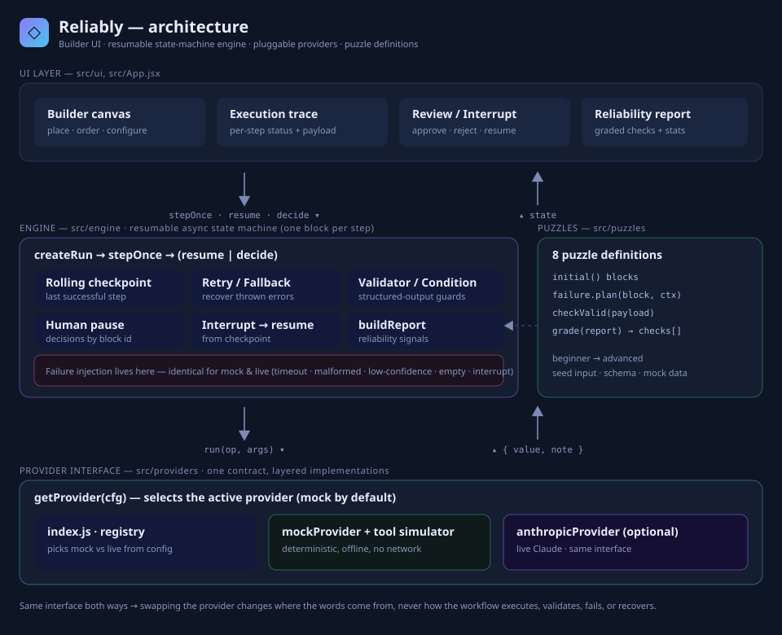

# Reliably — an AI Workflow Puzzle Lab

Build multi-step AI workflows, watch them break under realistic failures, and
repair them with **retries, fallbacks, validation, human review, and
checkpoint-resume**. Every puzzle runs fully offline against a deterministic
mock model — no API key required — and an optional live Claude provider drops in
behind the same interface.



---

## Run it locally

Requires Node 18+.

```bash
npm install
npm run dev        # opens http://localhost:5173
```

Other scripts:

```bash
npm run build      # production build to dist/
npm run preview    # serve the production build
npm test           # headless engine + puzzle checks (no browser)
```

No environment variables, no accounts, no network calls in the default (mock)
mode.

## Demo

> **Video:** https://www.loom.com/share/966da08338a14e12a3b35239b9145182

The walkthrough covers selecting a puzzle, building and modifying a workflow, running it normally, triggering a controlled failure, observing the failed step, recovering with retry/fallback, validating structured output, approving/editing/rejecting a human-review step, resuming from a checkpoint after an interruption, reviewing the execution trace and reliability report, and running entirely in mock AI mode.

---

## How it works

You assemble a workflow from **blocks** that run top-to-bottom, then press **Run**
and watch the execution trace fill in step by step. When a failure fires, you add
reliability blocks to catch and recover from it, then re-run until the reliability
report grades your workflow as resilient.

### The blocks

| Block | Purpose |
|-------|---------|
| **Input** | Commits the puzzle's sample input |
| **AI Model** | Runs an op (summarize / classify / draft / answer / plan) on `primary` or `fallback` model |
| **Tool / API** | Calls an external source (Live Web Search, Cached Index, Data Warehouse) |
| **Retrieval** | Fetches grounding documents |
| **Condition** | Branches on a check (e.g. *has evidence?*) — continue, stop safely, or route to a human |
| **Validator** | Checks structured output (owners present / confidence ≥ threshold / grounded); on fail: repair, retry-previous, route-to-human, or stop |
| **Retry** | Re-runs the executable step above it, up to N attempts |
| **Fallback** | Swaps to a backup model/source when the step above fails |
| **Human Review** | Pauses for a person to approve, edit, or reject |
| **Output** | Emits the final result |

Retry and Fallback protect the executable block **directly above** them.

### Running, failing, recovering

- **Failure simulation** is controlled by the *Failure armed* toggle. When armed,
  the active puzzle injects its scenario at the right step: a tool **timeout**, a
  **malformed** model output, a **low-confidence** classification, an **empty
  retrieval**, a **primary-model error**, or a **mid-run interruption**.
- **Retry / Fallback** recover *thrown* failures (timeouts, model errors). Retry
  re-attempts the same call; Fallback switches to a backup and continues.
- **Validation / human review** catch *bad data* that didn't throw — output that
  is malformed, unsure, or ungrounded. A Validator can auto-repair, re-run the
  previous step, stop safely, or escalate to a Human Review block that pauses the
  run until you decide.

Each run ends in one of three honest states — **completed**, **stopped safely**,
or **failed (unhandled)** — and the **reliability report** grades it against
per-puzzle checks (Was the failure caught? Recovered or safely stopped? Is the
output valid? Was anything shipped without oversight?).

### Checkpoint-resume (puzzle 8)

The engine keeps a **rolling checkpoint** of the last successful step. In
*Resume the Interrupted Mission*, an expensive ingest step finishes and is
checkpointed; then the run is interrupted before planning. You choose:

- **Resume from checkpoint** — continues from the last successful step; the
  expensive ingest is **not** re-run.
- **Restart from beginning** — throws progress away and re-runs everything
  (works, but wasteful — the report flags it).

This is genuine resumption, not a re-run from the start: the engine restores the
checkpoint's cursor and payload, so already-completed work is preserved.

---

## The puzzles

1. **Fix the Meeting Summarizer** *(beginner)* — validate structured output; the model drops action-item owners on its first pass.
2. **Approve Before Sending** *(beginner)* — gate an outbound message behind human review.
3. **Repair the Ticket Router** *(intermediate)* — a low-confidence classification must go to a human, not be auto-acted on.
4. **Validate the Data Extractor** *(intermediate)* — the model returns malformed JSON (missing field, wrong type); validate the schema and recover.
5. **Survive the Research Timeout** *(intermediate)* — a tool times out; recover with a fallback source.
6. **Ground the Knowledge Assistant** *(advanced)* — empty retrieval must trigger a safe refusal instead of a hallucination.
7. **Activate the Fallback** *(advanced)* — a primary model keeps erroring; retry, then fail over to a backup model.
8. **Resume the Interrupted Mission** *(advanced)* — continue from the last successful step after an interruption.

Add your own by dropping a module into `src/puzzles/` and listing it in
`src/puzzles/index.js`.

---

## Optional: use a live Claude model

Click the provider badge (top-right) → **settings** → switch to **Claude (live)**
and paste an Anthropic API key. The key is held in memory only and never
persisted. The engine is unchanged — only the *content* of AI steps becomes real.

> **Failure scenarios stay simulated even in live mode.** A real model won't
> deterministically time out or return malformed JSON on command, so the engine
> keeps injecting failures for consistent, reviewable puzzles. The provider's
> only job is generating content. See `src/providers/README.md` for the contract.

> **Security note:** live mode calls the Anthropic API directly from the browser
> using the `anthropic-dangerous-direct-browser-access` header, which exposes the
> key to client-side code. That's fine for a local demo with a throwaway key. For
> anything real, proxy the calls through a small backend and remove that header.

---

## Architecture

```
UI (src/ui, App.jsx)
  builder · trace · review/interrupt · report
        │ stepOnce() / resume / decide          ▲ state
        ▼                                        │
ENGINE (src/engine) ── resumable async state machine
  createRun → stepOnce (one block/step)
  rolling checkpoint · retry/fallback · validators/conditions
  human pause (decisions map) · interrupt→resume · buildReport
  ── failure injection lives HERE, not in providers ──
        │ run(op, args)                          ▲ { value, note }
        ▼                                        │
PROVIDERS (src/providers) ── one interface, two implementations
  getProvider(cfg) → mockProvider | anthropicProvider

PUZZLES (src/puzzles) feed the engine: initial() blocks,
  failure.plan(block, ctx), checkValid(payload), grade(report)
```

**Design decisions**

- **One block per `stepOnce` call.** The engine is a resumable state machine, not
  a run-to-completion function. That's what makes pause/resume, mid-run
  interruption, and step-by-step trace animation fall out naturally.
- **Failure injection lives in the engine, not the providers.** This is the key
  decision that lets mock and live share identical execution, validation, and
  recovery behaviour — every puzzle stays deterministic and reviewable no matter
  which model backs it.
- **Providers are pure content generators** behind a tiny `run(op, args)`
  contract, so adding OpenAI, a local model, etc. is a single file.
- **Validation is swappable.** `src/engine/validators.js` is plain functions
  returning `{ valid, detail }`; replace with JSON Schema / Zod without touching
  the engine.
- **No persistence, no build-time secrets.** State is in-memory React state;
  nothing is written to disk or localStorage.

### Layout

```
src/
  engine/     blocks · validators · engine (state machine) · grading
  providers/  index (registry) · mockProvider · anthropicProvider · README
  puzzles/    one module per puzzle + index
  ui/         styles (tokens+CSS) · ConfigEditor · TracePanel · ReviewPanel · ReportCard
  App.jsx     builder UI + async run driver
test/         headless engine + puzzle checks
docs/         architecture.svg
```

---

## Assumptions & known limitations

- **Linear workflows.** Blocks execute top-to-bottom. Conditions can stop or
  escalate but there's no arbitrary branching/DAG — deliberate, to keep the
  puzzles legible.
- **Simulated failures by design.** Even with a live model, failures are injected
  by the engine so puzzles behave identically every run.
- **Mock content is fixed** to a few scenarios (a meeting, a billing ticket, a
  revenue question) — enough to make each reliability pattern land.
- **Live mode is browser-direct** and single-turn per op; production usage should
  proxy through a backend (see the security note above). `retrieve`/`research`
  fall back to fixtures in live mode.
- **No auth, multiplayer, or saved progress.** Reloading resets the lab.

---

## Testing

`npm test` drives the engine headlessly and asserts, for every puzzle, that the
intended solution grades **passed** and that the broken/naive version grades
**failed** — including that resume runs the expensive step once while restart
runs it twice. 19 checks, no browser required.
